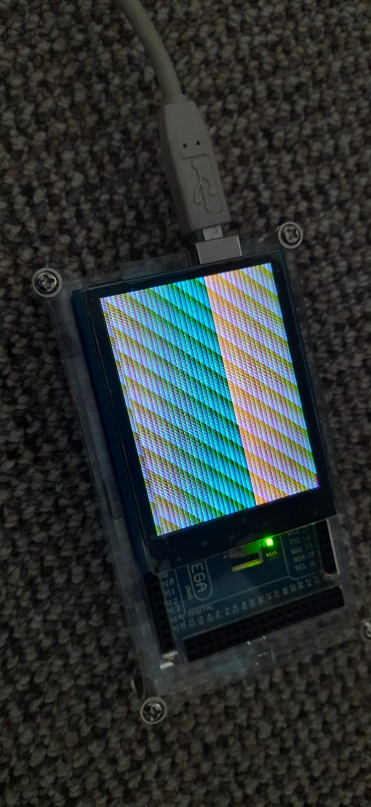

# Colour Lister

 

## Parts:
* Arduino MEGA 2560
* A [2.8'' TFT LCD shield w/Cap Touch and microSD](https://www.adafruit.com/product/1947)
(anything that works with ILI9341 should work)

## Setup:
1. Attach the TFT to the top of the arduino
1. Change your settings in colour_list.ino
    * `DEBUG`: whether or not to serial print debug messages
    * `BRIGHTNESS`: 0-255 for the backlight strength
    * `WIDTH` & `HEIGHT`: change if you use a different screen or a different orientation
1. Upload the sketch
1. See the colours
